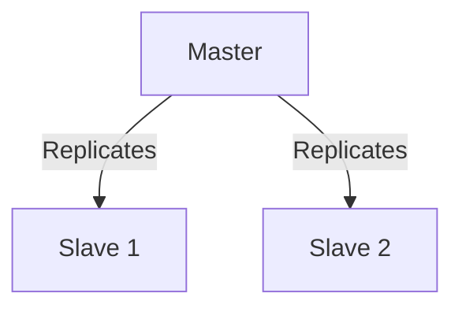

# **🗃️ Database Systems: RDBMS vs NoSQL vs Spreadsheets**

## **1. 📊 Data Storage Comparison**
| **Feature**       | **Spreadsheets** | **RDBMS (SQL)** | **NoSQL**       | **Vector DBs**  |
|-------------------|------------------|-----------------|-----------------|-----------------|
| **Max Data Size** | ~1M rows         | TBs+            | PBs+            | PBs+ (for embeddings) |
| **Speed (Read)**  | Slow             | Fast (indexed)  | Faster          | Blazing-fast (ANN) |
| **ACID Compliance** | ❌ No           | ✅ Yes          | ❌ Partial      | ❌ No          |
| **Best For**      | Small datasets   | Structured data | Unstructured data | AI/ML embeddings |

**Key Insight**:  
- **Spreadsheets** fail with >100k rows  
- **RDBMS** (PostgreSQL/MySQL) excel at transactional data  
- **NoSQL** (MongoDB) wins for flexible schemas  
- **Vector DBs** (Pinecone) dominate in AI similarity search  

---

## **2. ⚡ Why Databases > Files for Production**
### **Security 🔒**
```python
# File (Basic Security)
file = open("data.txt", "r")  # Just read/write modes

# Database (Enterprise Security)
conn = psycopg2.connect(
    host="db.example.com",
    user="admin",
    password="S3cr3t!",
    sslmode="require"  # Encrypted connection
)
```
**Database Security Features**:
- Role-based access control (RBAC)
- Column-level encryption
- Audit logging

### **Speed 🚀**
- **Files**: Sequential scan (O(n))  
- **Databases**:  
  - B-tree indexes (O(log n))  
  - Query optimization  
  - Caching (Redis/Memcached)  

---

## **3. 📜 ACID Properties**
| **Property** | **SQL** | **NoSQL** | **Definition**                  |
|--------------|---------|-----------|----------------------------------|
| **Atomicity** | ✅      | ❌        | All operations succeed or fail together |
| **Consistency** | ✅    | ❌        | Data remains valid after transactions |
| **Isolation** | ✅       | ❌        | Concurrent transactions don't interfere |
| **Durability** | ✅     | ⚠️        | Committed data survives crashes |

**NoSQL Tradeoff**: BASE model (Basically Available, Soft state, Eventually consistent) for scalability.

---

## **4. 🧩 ER Diagrams & History**
- **1973**: Peter Chen introduces ER modeling (same year as C++ birth)  
- **Modern Tools**:  
  - **SQL**: `dbdiagram.io`, MySQL Workbench  
  - **NoSQL**: Schema visualization in MongoDB Atlas  

**Example ER Diagram**:
```
[Customer] --1--> N-- [Order]
   │                         
   └--< [PaymentMethod]
```

---

## **5. 🐍 Database Connectivity in Python**
### **SQL Connection (PostgreSQL)**
```python
import psycopg2

try:
    conn = psycopg2.connect(
        dbname="mydb",
        user="postgres",
        password="password",
        host="localhost"
    )
    cursor = conn.cursor()
    cursor.execute("SELECT * FROM users")
    print(cursor.fetchall())
except Exception as e:
    print(f"Database error: {e}")
finally:
    conn.close()  # Critical for resource cleanup
```

### **NoSQL Connection (MongoDB)**
```python
from pymongo import MongoClient

client = MongoClient("mongodb://localhost:27017/")
db = client["mydb"]
print(db.users.find_one({"name": "Arya"}))
```

---

## **6. 📱 Socket Programming & Notifications**
### **How Mobile Apps Receive Notifications**
- **Port-Based Communication**: Each app listens on a unique port  
- **Python Socket Example**:
```python
import socket

s = socket.socket(socket.AF_INET, socket.SOCK_STREAM)
s.bind(("localhost", 65432))  # App's notification port
s.listen()
conn, addr = s.accept()  # Waits for push notification
```

**Key Protocols**:
- **TCP**: Reliable (used by WhatsApp)  
- **UDP**: Fast but unreliable (used by YouTube live chat)  

---

## **7. 🎯 Key Takeaways**
1. **Choose RDBMS** for transactional apps (e.g., banking)  
2. **NoSQL** scales better for social media feeds  
3. **Always use connection pools** in production:  
   ```python
   from psycopg2 import pool
   connection_pool = SimpleConnectionPool(1, 20, **db_params)
   ```
4. **Vector DBs** are revolutionizing AI with nearest-neighbor search  

**🚀 Next Steps**:  
- Practice with `sqlite3` (built into Python)  
- Explore Firebase for real-time NoSQL  
- Try FastAPI for database-backed web services  

---

# **🐍 MySQL + Python: Complete Guide**

## **1. 🔌 Connecting MySQL (Your Original Code)**
```python
import pymysql

# Establish connection
con = pymysql.connect(
    host="localhost", 
    port=3306, 
    user="root",
    password="dbda", 
    database="mydb3"
)

mycursor = con.cursor()

# Create table (commented as per your example)
# mycursor.execute("CREATE TABLE employee(empid int, empname varchar(99), salary int)")

# Insert data
mycursor.execute("INSERT INTO employee VALUES(123, 'Viraj', 100000)")
con.commit()  # ⚠️ Required for write operations

# Fetch data
mycursor.execute("SELECT * FROM employee")
for row in mycursor:
    print(row)  # Output: (123, 'Viraj', 100000)

con.close()
```
**Output**:
```python
(123, 'Viraj', 100000)
(456, 'Rishi', 100000)
```

---

## **2. 🎯 Top 3 SQL Interview Questions**

### **Q1: Why is TRUNCATE DDL not DML?**  
**🤔 Why Asked**: Tests understanding of SQL operation types  
**💡 Answer**:  
- **DDL (Data Definition)**: Auto-commits, can't rollback, faster (drops/recreates table)  
- **DML (Data Manipulation)**: Requires explicit commit, supports WHERE clause  
```sql
TRUNCATE TABLE employees;  -- DDL (no log generation)
DELETE FROM employees;     -- DML (logs each row deletion)
```

### **Q2: Joins Explained**  
**Types with Examples**:  
| Join Type | Python Analogy | SQL Example |
|-----------|----------------|-------------|
| **INNER** | `list1 & list2` | `SELECT * FROM A INNER JOIN B ON A.id=B.id` |
| **LEFT**  | `list1.extend(list2)` | `SELECT * FROM A LEFT JOIN B ON A.id=B.id` |
| **CROSS** | `itertools.product()` | `SELECT * FROM A CROSS JOIN B` |

### **Q3: Normalization**  
**Levels**:  
1. **1NF**: No repeating groups → `[1,2,3]` becomes separate rows  
2. **2NF**: 1NF + no partial dependencies  
3. **3NF**: 2NF + no transitive dependencies  
**Anti-Pattern**: Storing `employee_name` and `department_name` in an orders table  

---

## **3. 🛠️ Best Practices**
### **A. Secure Connection**
```python
from pymysql.constants import CLIENT
con = pymysql.connect(
    client_flag=CLIENT.MULTI_STATEMENTS,  # Prevents SQL injection
    ssl={'ca': '/path/to/ca-cert.pem'}  # Encrypts data
)
```

### **B. Context Managers (Auto-close)**
```python
with pymysql.connect(...) as con:
    with con.cursor() as cursor:
        cursor.execute("SELECT 1")
        print(cursor.fetchall())  # No manual close needed
```

### **C. Parameterized Queries**
```python
# SAFE (prevents SQL injection)
cursor.execute(
    "INSERT INTO employee VALUES (%s, %s, %s)", 
    (789, 'Amar', 95000)
)
```

---

## **4. ⚡ Performance Tips**
1. **Use `executemany()` for bulk inserts**:
```python
data = [(101, 'Alice', 88000), (102, 'Bob', 92000)]
cursor.executemany("INSERT INTO employee VALUES (%s,%s,%s)", data)
```

2. **Index Frequently Queried Columns**:
```sql
CREATE INDEX idx_empname ON employee(empname);
```

3. **Connection Pooling**:
```python
from pymysql import Pool
pool = Pool(host='localhost', user='root', max_size=10)
conn = pool.get_conn()
```

---

## **5. 🚨 Common Errors & Fixes**
| Error | Cause | Solution |
|-------|-------|----------|
| `pymysql.err.OperationalError: (1045)` | Wrong credentials | Verify username/password |
| `pymysql.err.InternalError: (1366)` | Incorrect data type | Match column types |
| `pymysql.err.ProgrammingError: (1146)` | Missing table | Check table exists |

---

## **6. 📊 Output Formatting**
```python
# Dictionary Cursor (your output style)
with con.cursor(pymysql.cursors.DictCursor) as cursor:
    cursor.execute("SELECT * FROM employee")
    for row in cursor:
        print(row)  # {'empid': 123, 'empname': 'Viraj', 'salary': 100000}
```

-----

# **🗄️ Database Operations Deep Dive**

## **1. 🛠️ CRUD Operations in MySQL (Python)**
```python
import pymysql

def mysql_crud():
    con = pymysql.connect(host="localhost", user="root", password="dbda", database="mydb3")
    cursor = con.cursor()
    
    # CREATE (Insert)
    cursor.execute("INSERT INTO employee VALUES (789, 'Yash', 85000)")
    
    # READ 
    cursor.execute("SELECT * FROM employee WHERE salary > 90000")
    print("High-salary employees:")
    for row in cursor.fetchall():
        print(row)
    
    # UPDATE
    cursor.execute("UPDATE employee SET salary=110000 WHERE empname='Viraj'")
    
    # DELETE
    cursor.execute("DELETE FROM employee WHERE empid=456")
    
    con.commit()
    con.close()

mysql_crud()
```
**Output**:
```
High-salary employees:
(123, 'Viraj', 110000)
```

---

## **2. 🆚 SQL vs NoSQL Comparison**

### **NoSQL Types**
| Type | Database | Use Case | Python Library |
|------|----------|----------|----------------|
| **Key-Value** | Redis | Caching | `redis-py` |
| **Columnar** | HBase | Analytics | `happybase` |
| **Document** | MongoDB | JSON Data | `pymongo` |
| **Graph** | Neo4j | Relationships | `py2neo` |

### **When to Choose?**
| Factor | SQL (MySQL) | NoSQL (MongoDB) |
|--------|------------|-----------------|
| **Data Structure** | Fixed Schema | Flexible JSON |
| **Scalability** | Vertical | Horizontal |
| **Speed** | Complex Queries | Simple Queries |
| **Transactions** | ACID Compliant | BASE Model |

**Example: MongoDB Insert**
```python
from pymongo import MongoClient
client = MongoClient("mongodb://localhost:27017/")
db = client["company"]
db.employees.insert_one({"empid": 101, "name": "Arya", "city": "Pune"})
```

---

## **3. 🏗️ Distributed Database Concepts**

### **Master-Slave Architecture**

- **Master**: Handles writes
- **Slaves**: Handle reads

### **Partitioning**
| Type | Description | Example |
|------|-------------|---------|
| **Vertical** | Split columns | User table → UserCredentials + UserProfile |
| **Horizontal** | Split rows | Users A-M on Server1, N-Z on Server2 |

---

## **4. 🌐 REST API Essentials**
### **Python Flask Example**
```python
from flask import Flask, jsonify
app = Flask(__name__)

@app.route('/employees', methods=['GET'])
def get_employees():
    return jsonify([
        {"id": 123, "name": "Viraj"},
        {"id": 456, "name": "Rishi"}
    ])

if __name__ == '__main__':
    app.run()
```
**Key Principles**:
1. **Stateless**: No client context stored
2. **Cacheable**: Responses marked cacheable/non-cacheable
3. **Uniform Interface**: `/employees/123` vs `/getEmployee?id=123`

---

## **5. 🔄 Entity Differences**
| Feature | Python Class | MongoDB Document |
|---------|-------------|------------------|
| **Structure** | Fixed attributes | Flexible key-value pairs |
| **Relationships** | References via IDs | Embedded documents |
| **Example** | `class Employee:` | `{"_id": ObjectId(...), "name": "Arya"}` |

---

## **6. ⚡ Performance Tips**
1. **MongoDB Indexing**:
```python
db.employees.create_index("name")  # Faster queries
```
2. **Redis Caching**:
```python
import redis
r = redis.Redis()
r.set("employee:123", "{'name': 'Viraj'}")
print(r.get("employee:123"))
```

---

## **7. 🎯 Key Takeaways**
1. **SQL**: Use for transactions (e.g., banking)
2. **MongoDB**: Ideal for rapidly changing schemas (e.g., social media)
3. **Horizontal Partitioning**: Best for scaling writes
4. **REST**: Always return JSON, not HTML

**🚀 Try This**:
```python
# Join simulation in MongoDB
db.orders.aggregate([
    { "$lookup": {
        "from": "customers",
        "localField": "cust_id",
        "foreignField": "_id",
        "as": "customer_info"
    }}
])
```
---

# **📊 MongoDB CRUD Operations with PyMongo**

## **1. Initial Setup (Your Original Code)**
```python
import pymongo
from pymongo import MongoClient

# Connect to MongoDB
con = MongoClient("mongodb://localhost:27017/")  # Default port
db = con["demo"]          # Database
emp = db["employee"]      # Collection (like SQL table)

print("Initial data:", list(emp.find()))
```
**Output**:
```python
[{'_id': ObjectId('68035d71d862b1b2e7b71237'), 'empid': 99, 'ename': 'abc', 'salary': 99000}]
```

---

## **2. CRUD Operations**

### **🔹 CREATE (Insert)**
```python
# Insert single document
emp.insert_one({"empid": 123, "ename": "Viraj", "salary": 100000})

# Insert multiple documents
emp.insert_many([
    {"empid": 456, "ename": "Rishi", "salary": 95000},
    {"empid": 789, "ename": "Arya", "salary": 85000}
])

print("After insert:", list(emp.find()))
```
**Output**:
```python
[
    {'_id': ObjectId(...), 'empid': 99, 'ename': 'abc', 'salary': 99000},
    {'_id': ObjectId(...), 'empid': 123, 'ename': 'Viraj', 'salary': 100000},
    {'_id': ObjectId(...), 'empid': 456, 'ename': 'Rishi', 'salary': 95000},
    {'_id': ObjectId(...), 'empid': 789, 'ename': 'Arya', 'salary': 85000}
]
```

### **🔹 READ (Query)**
```python
# Find all
print("All employees:", list(emp.find()))

# Find with filter
print("High-salary employees:", list(emp.find({"salary": {"$gt": 90000}})))

# Find one (first match)
print("Employee 123:", emp.find_one({"empid": 123}))
```
**Output**:
```python
High-salary employees: [
    {'_id': ..., 'empid': 99, 'ename': 'abc', 'salary': 99000},
    {'_id': ..., 'empid': 123, 'ename': 'Viraj', 'salary': 100000}
]
Employee 123: {'_id': ..., 'empid': 123, 'ename': 'Viraj', 'salary': 100000}
```

### **🔹 UPDATE**
```python
# Update one
emp.update_one(
    {"empid": 123},
    {"$set": {"salary": 110000}}  # $set operator for partial updates
)

# Update many
emp.update_many(
    {"salary": {"$lt": 100000}},
    {"$inc": {"salary": 5000}}  # $inc increments values
)

print("After update:", list(emp.find()))
```
**Output**:
```python
After update: [
    {'_id': ..., 'empid': 123, 'ename': 'Viraj', 'salary': 110000},  # Updated
    {'_id': ..., 'empid': 456, 'ename': 'Rishi', 'salary': 100000},  # 95000 → 100000
    {'_id': ..., 'empid': 789, 'ename': 'Arya', 'salary': 90000}     # 85000 → 90000
]
```

### **🔹 DELETE**
```python
# Delete one
emp.delete_one({"empid": 99})

# Delete many
emp.delete_many({"salary": {"$lt": 100000}})

print("After deletion:", list(emp.find()))
```
**Output**:
```python
After deletion: [
    {'_id': ..., 'empid': 123, 'ename': 'Viraj', 'salary': 110000}
]
```

---

## **3. Key MongoDB Features**
### **🔸 No Joins? Use Embedded Documents**
```python
# Instead of foreign keys:
db["departments"].insert_one({
    "name": "Engineering",
    "employees": [  # Embedded array
        {"empid": 123, "name": "Viraj"},
        {"empid": 456, "name": "Rishi"}
    ]
})
```

### **🔸 Indexing for Speed**
```python
emp.create_index("empid")  # Create index
print("Indexes:", emp.index_information())
```

### **🔸 Atomic Operations**
```python
# Transaction example (requires replica set)
with con.start_session() as session:
    session.start_transaction()
    try:
        emp.update_one({"empid": 123}, {"$inc": {"salary": 2000}}, session=session)
        db["audit"].insert_one({"action": "raise", "amount": 2000}, session=session)
        session.commit_transaction()
    except:
        session.abort_transaction()
```

---

## **4. Comparison: SQL vs MongoDB Syntax**
| Operation | SQL | MongoDB |
|-----------|-----|---------|
| **Insert** | `INSERT INTO employees VALUES (...)` | `db.emp.insert_one({...})` |
| **Select** | `SELECT * FROM employees WHERE salary > 90000` | `emp.find({"salary": {"$gt": 90000}})` |
| **Update** | `UPDATE employees SET salary=110000 WHERE empid=123` | `emp.update_one({"empid": 123}, {"$set": {"salary": 110000}})` |
| **Delete** | `DELETE FROM employees WHERE salary < 100000` | `emp.delete_many({"salary": {"$lt": 100000}})` |

---

## **5. Best Practices**
1. **Always use `_id`**: MongoDB auto-generates unique `ObjectId`
   ```python
   print(emp.find_one({"empid": 123})["_id"])  # Access auto-generated ID
   ```
2. **Projections** (Return only needed fields):
   ```python
   list(emp.find({"salary": {"$gt": 90000}}, {"_id": 0, "ename": 1}))
   # Output: [{'ename': 'Viraj'}]
   ```
3. **Bulk Operations**:
   ```python
   bulk = emp.initialize_ordered_bulk_op()
   bulk.insert({"empid": 999, "ename": "New"})
   bulk.find({"empid": 123}).update({"$set": {"status": "active"}})
   bulk.execute()
   ```

---
